# Android Application Security Assessment: Beetlebug

## Objective
Performed a controlled Android application assessment using static analysis, ADB-driven dynamic testing, storage inspection, and backend validation to identify eight security weaknesses.

### Skills Learned
- Mapped application resources, exported activities, embedded values, and backend URLs.
- Pulled SQLite and Shared Preferences artifacts and verified plaintext sensitive data.
- Monitored Logcat for credit-card and PII leakage.
- Validated SQL injection, public Firebase access, and unauthenticated administrator activity invocation.
- Assigned risk ratings and paired every finding with actionable remediation.

### Tools Used
- JADX
- ADB
- Logcat
- SQLite Browser
- curl
- jq
- Android emulator

## Steps

*Ref 1: By reviewing the apk code, I noticed that the pin used to unlock the folder is being compared to a hardcoded string located under resources/res/strings.xml file.*

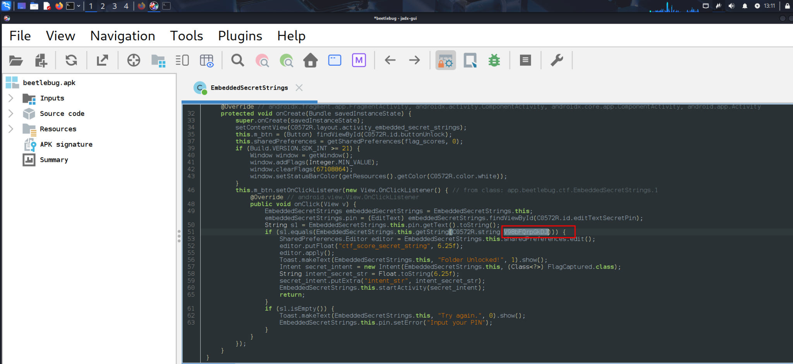

*Ref 2: When reviewing the strings.xml file we find the hardcoded pin 7432580.*

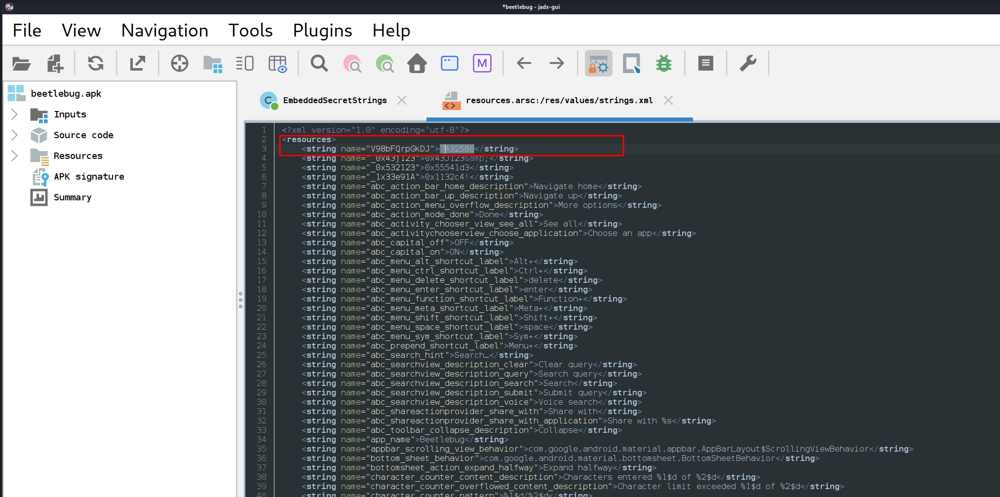

*Ref 3: EMBEDDED SECRETS*

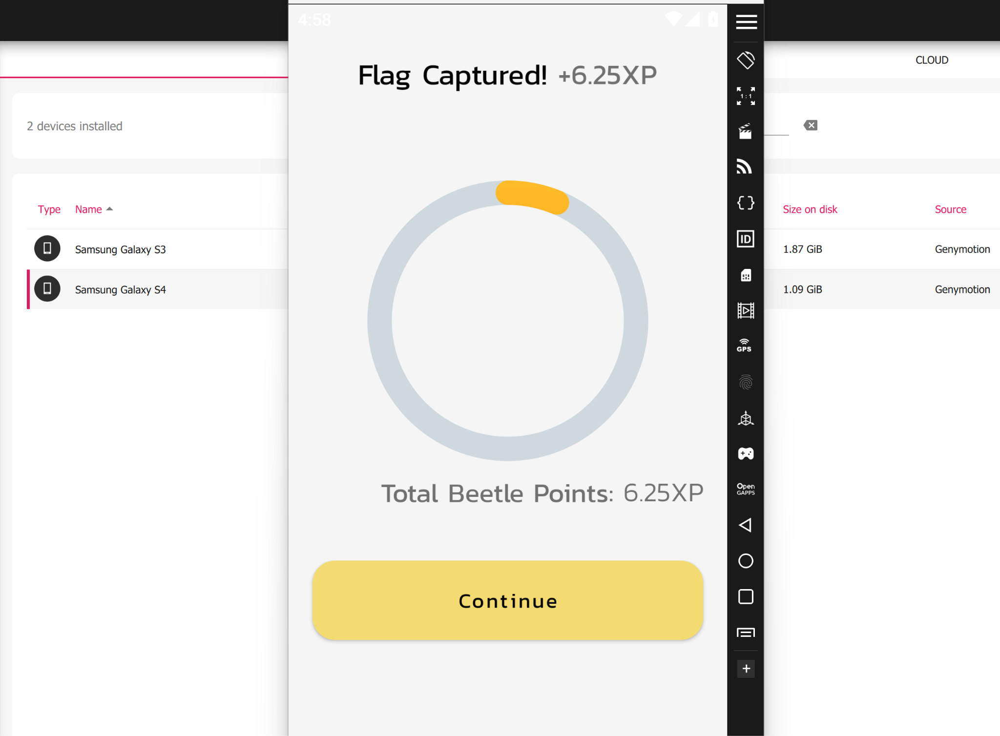

*Ref 4: By inspecting the class associated with promo code, I realized that the promocode is hardcoded as beetle1759.*

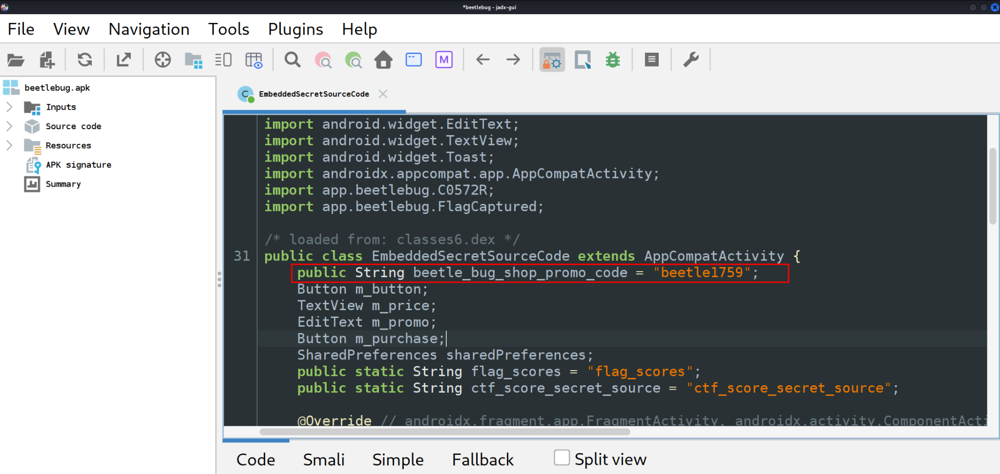

*Ref 5: The promo code gives a discount of $300 and can be used multiple times by the same person*

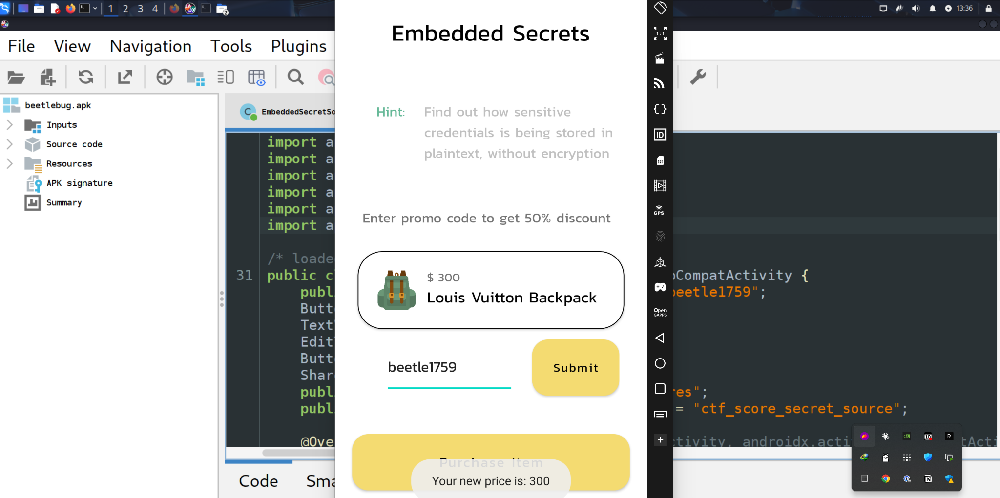

*Ref 6: By using the adb tool to pull the shared_pref_flag.xml file, I am able to view the username and password entered on the front end.*

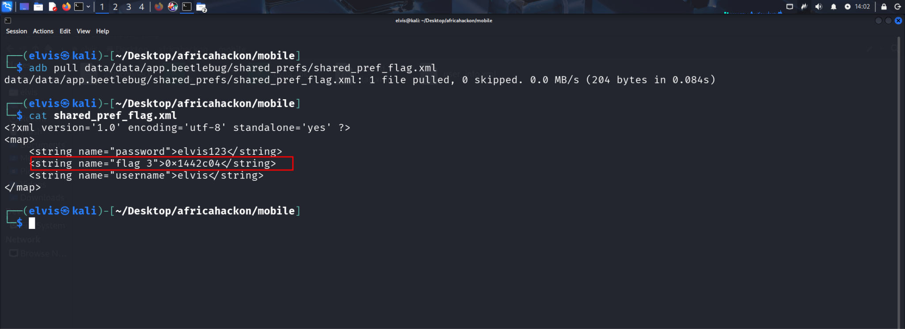

*Ref 7: SQLITE STORAGE*

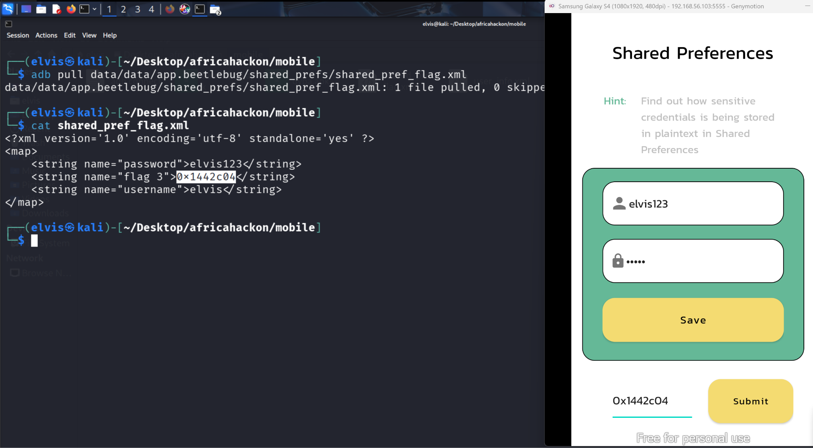

*Ref 8: SQLITE STORAGE*

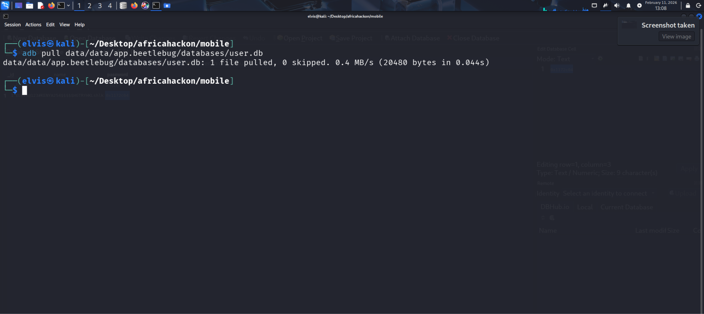

*Ref 9: The master pin used to login is stored in a sqlite database in plain text.*

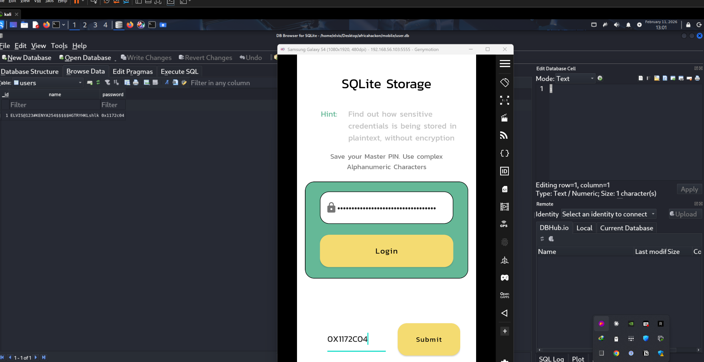

*Ref 10: By using a basic sql query, I am able to view credentials of other users in the database.*

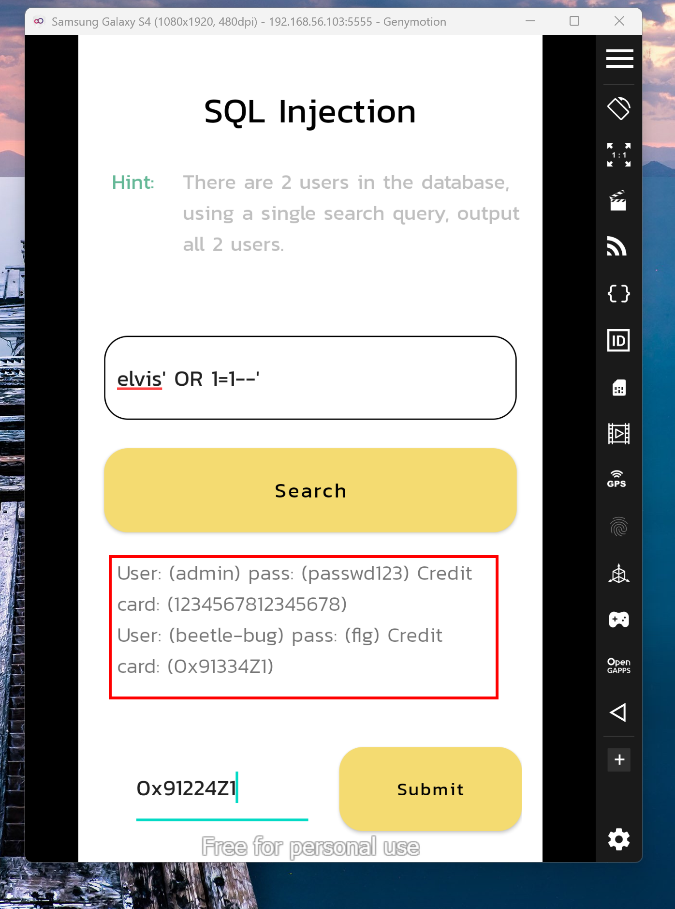

*Ref 11: By reviewing the strings.xml file, i found a firebase url, https://beetlebug-374fc-default-rtdb.firebaseio.com*

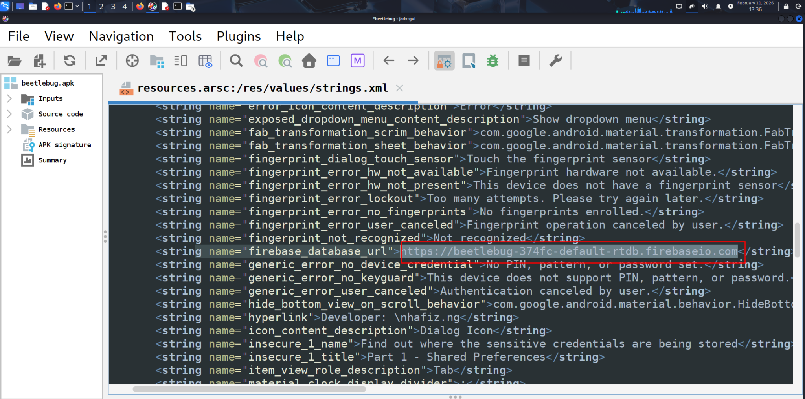

*Ref 12: Using the curl command and piping the results via jq (json processing tool), the database details are exposed and readable.*

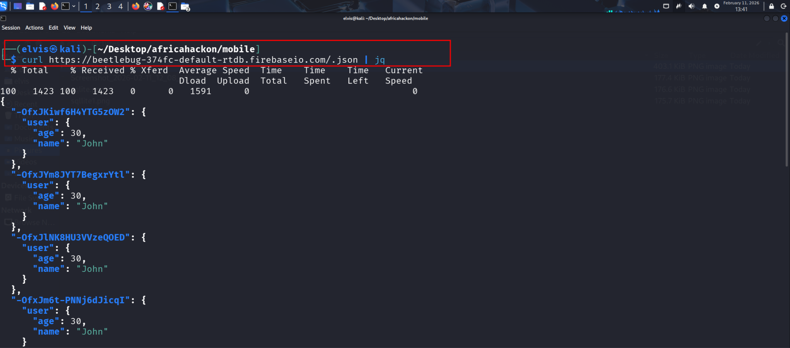

*Ref 13: I am able to extract the flag from the database results.*

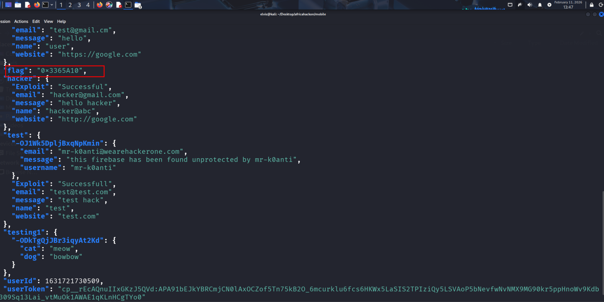

*Ref 14: INSECURE LOGGING*

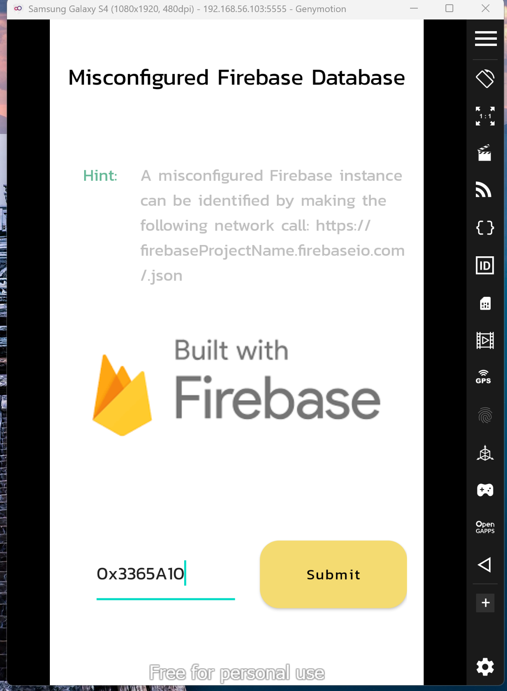

*Ref 15: Insecure logging occurs when an application writes sensitive information—such as credentials, session tokens, or PII—to the Android system log (Logcat).*

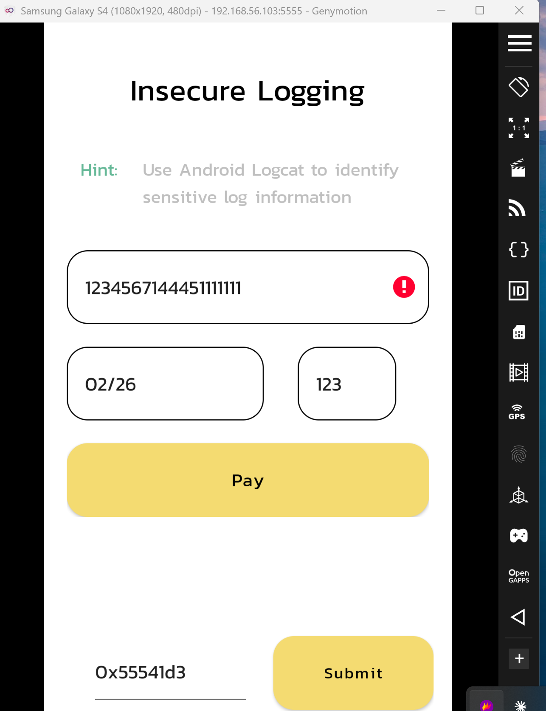

*Ref 16: Using the adb tool and running the command adb logcat and inspecting the logs, I am able to view credit card details on the applications logs.*

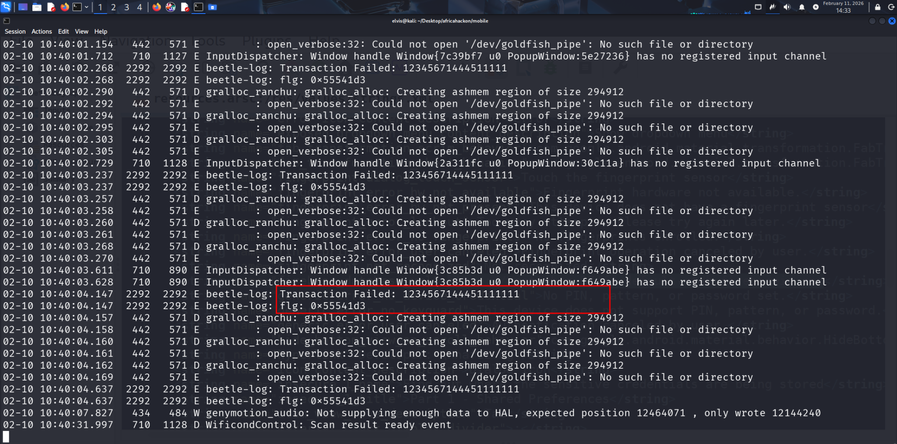

*Ref 17: As I was reviewing the strings.xml file I noticed admin activity that is exported which I call and find the flag.*

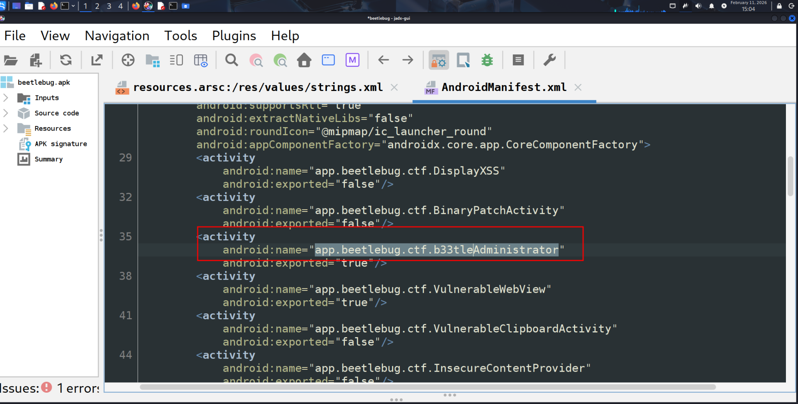

*Ref 18: By running the command (adb shell am start -n app.beetlebug/.ctf.b33tleAdministrator) I am able to access the administrators portal.*

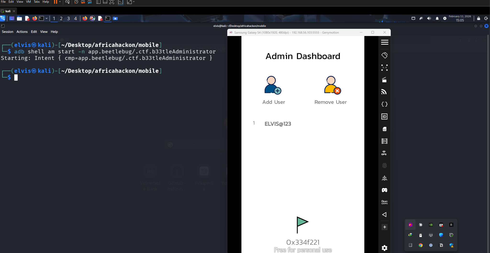
